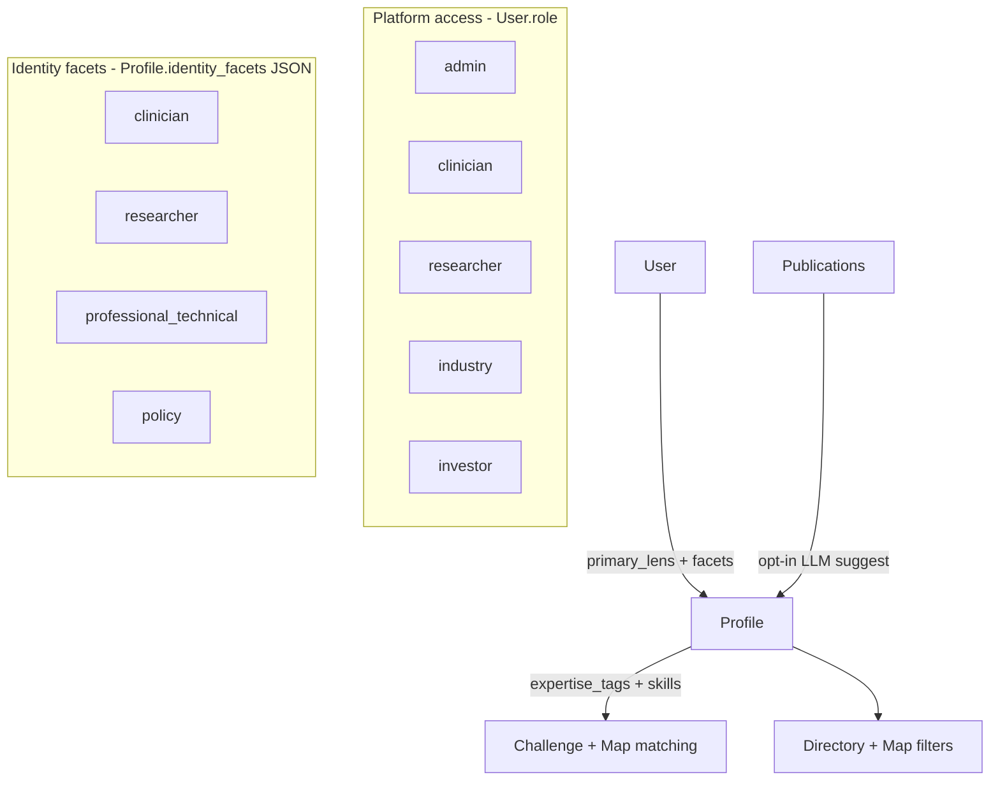

# CBDRH Feedback — Concrete Implementation Plan

Derived from the Current State Audit. Decisions below lock the audit’s suggested defaults because work proceeded without further detail answers. Out of scope for this plan: NHS API, LinkedIn/Scholar OAuth, CBDRH news feed, email preference UI (follow-ups).

---

## Locked product decisions

| Question | Decision |
|----------|----------|
| Roles model | **Identity facets (multiselect)** on Profile, orthogonal to **platform access role** on User (`admin` stays access-only; `investor`/`industry` remain access roles for portals) |
| “Other” staff | One catch-all facet `professional_technical` + free-text `professional_title` (e.g. biostatistician, lab tech) — not a separate enum per job |
| UI impact | Facets drive **Directory filters, Map lens/filters, Challenge matching filters**; **primary_lens** (one of the selected facets) drives default Dashboard/nav emphasis |
| LLM enrichment | **User-facing opt-in** first: suggest tags/skills from PubMed titles (+ abstracts when available); user confirms. Also improve seed enrichment. Sources order: PubMed → (later) UNSW pages |
| Challenge vs Map | **Keep Challenge Board**; extend Map + profiles with **skills/capabilities** so both knowledge and soft-skill find work |
| Ship first | **Phase 1:** facets + career level + profile privacy. **Phase 2:** skills + LLM keyword suggest + **capability Challenge matching fix**. **Phase 3:** affiliation status (**reverted** — not needed for demo) |
| Affiliation | ~~Deferred / reverted~~ — was user-claimed `affiliation_status`; not shipped |

---

## Architecture

**Permission rule:** Keep existing `require_roles([User.role])` for API gates. New matching/discovery filters use `Profile.identity_facets` and `primary_lens`. On signup, selected facets seed `User.role` as: if includes clinician → `clinician`; else if researcher → `researcher`; else if professional_technical → `researcher` (broadest member access until a dedicated access role is needed); industry/investor unchanged.

---

## Phase 1 — Identity, career level, privacy (ship first)

### 1.1 Data model

**Files:** [Backend/app/models.py](../Backend/app/models.py), [Backend/app/schemas.py](../Backend/app/schemas.py), [Backend/app/seed.py](../Backend/app/seed.py)

Add on `Profile`:

- `identity_facets: list[str]` — JSON, values from `{clinician, researcher, professional_technical, policy}`
- `primary_lens: str | None` — must be one of `identity_facets`
- `professional_title: str | None` — free text when `professional_technical` selected
- `career_level: str | None` — enum-like: `student | ecr | mid | senior | executive`
- Keep `is_public`; enforce on detail GET

Migration approach: extend model + recreate/reseed in dev (`seed.py`) against local SQLite or Railway PostgreSQL; document that longer-lived production would need Alembic.

Seed mapping:

- Clinician mock profiles → `["clinician"]` or `["clinician","researcher"]` where dual identity is implied
- Manifest researchers → `["researcher"]`; clinical academics → `["clinician","researcher"]`
- Add 2–3 demo `professional_technical` profiles (data analyst, registry manager, biostatistician)

### 1.2 Auth / signup / admin

**Files:** [Backend/app/routers/auth.py](../Backend/app/routers/auth.py), [Frontend/src/pages/SignupPage.jsx](../Frontend/src/pages/SignupPage.jsx), [Frontend/src/pages/AdminPage.jsx](../Frontend/src/pages/AdminPage.jsx), [Frontend/src/context/AuthContext.jsx](../Frontend/src/context/AuthContext.jsx)

- Signup: multiselect facets + primary lens + optional career level + professional title
- Create `Profile` row at signup (today signup only creates `User`)
- JWT/login payload: keep `role`; add `identity_facets`, `primary_lens`, `career_level` for UI
- Admin: edit facets + access role separately

### 1.3 Roles helpers + badges

**Files:** [Frontend/src/utils/roles.js](../Frontend/src/utils/roles.js), [Frontend/src/components/ui/RoleBadge.jsx](../Frontend/src/components/ui/RoleBadge.jsx)

- Add `IDENTITY_FACETS`, labels, `hasFacet(facets, x)`, `primaryLensNav(user)`
- `RoleBadge`: support multiple facet chips; keep admin/investor as access badges
- Nav: `getNavLinks` still uses access `role`; Dashboard copy/sections prefer `primary_lens`

### 1.4 Directory + Map filters (Erandi’s case)

**Files:** [Backend/app/routers/directory.py](../Backend/app/routers/directory.py), [Frontend/src/pages/DirectoryPage.jsx](../Frontend/src/pages/DirectoryPage.jsx), [Backend/app/services/map_service.py](../Backend/app/services/map_service.py), [Backend/app/routers/knowledge_map.py](../Backend/app/routers/knowledge_map.py), [Frontend/src/pages/MapPage.jsx](../Frontend/src/pages/MapPage.jsx)

- Directory query params: `facets` (AND), `career_level`, existing specialty/institution
- Example: `facets=clinician,researcher` + specialty pediatrics → clinician-researchers only
- Map role lens: filter nodes by facet membership, not only `User.role`
- Show facet chips on cards/panels

### 1.5 Profile privacy opt-in

**Files:** directory router, Profile page/settings section, schemas

- `PATCH /directory/me` (or `/profiles/me`): owner can set `is_public`, facets, career_level, professional_title, primary_lens
- Enforce: non-owner `GET /directory/{id}` → 404 if `is_public=False`
- UI: “Show me in Directory & Map” toggle on own profile (default `True` for seeded demos; `False` for brand-new signups until they opt in — carrot framing)

### 1.6 Phase 1 acceptance

- User can be clinician+researcher; Erandi can filter that combination
- Lab tech / analyst can sign up as `professional_technical` without a new access role explosion
- Career level visible and filterable
- Private profiles hidden from search, map, and direct ID fetch for others

---

## Phase 2 — Skills + LLM keyword suggest + capability Challenge fix

Phase 2 also fixes the “need a biostatistician → psychiatry professors” failure: Challenges must distinguish **knowledge** asks from **capability/role** asks and stop forcing a top-3 with fabricated “clinical gap” copy.

### 2.1 Skills field

**Files:** models, schemas, ProfilePage, Challenge matching, map_service, seed

- Add `Profile.skills: list[str]` (capabilities: “biostatistics”, “data visualisation”, “registry management”, etc.)
- Separate from `expertise_tags` (knowledge/topics)
- Profile UI: Skills section (self-edit + suggested)
- Seed professional_technical demos with real skills (e.g. Priya Nair → biostatistics)
- Map: optional edge weight using skills overlap as well as tags

### 2.2 Challenge kind + honest capability matching (bring forward from former Phase 3)

**Files:** Challenge model, ChallengeForm, challenges router, [ai_service.py](../Backend/app/services/ai_service.py), MatchCard / ChallengePage

- Add `challenge_kind: knowledge | capability | either` (default `either`; UI copy explains the difference)
- **Knowledge** → weight `expertise_tags` + specialty (today’s path, improved)
- **Capability** → weight `skills` + `title` / `professional_title` + `identity_facets` (prefer `professional_technical`); deprioritise topic-only professors
- **Either** → blend both; still prefer role/skill hits when the title clearly names a role (e.g. “biostatistician”)
- **No forced top-3:** if no candidate clears a minimum score, return empty matches + UI: “No strong capability match” with deep links to Directory/Map filtered by facet/skills
- **Honest reasoning:** drop the fixed “clinical gap” template; only cite real overlaps (skill, title, facet, or tag)
- Candidate pool for capability: include professional_technical even when specialty filter is set, when skills/title match

### 2.3 PubMed abstracts + suggest endpoint

**Files:** [Backend/app/services/pubmed_service.py](../Backend/app/services/pubmed_service.py), [Backend/app/services/ai_service.py](../Backend/app/services/ai_service.py), directory/profile endpoint

- Extend PubMed fetch with `efetch` abstracts (cache in `pubmed_cache.json` or publication row)
- `POST /profiles/me/suggest-keywords` (opt-in): LLM (Anthropic/mock) reads recent titles+abstracts → proposed `expertise_tags` + `skills`
- Response is **suggestions only**; `PATCH` applies after user confirms (no silent overwrite)
- Seed path: optional auto-suggest into manifest gaps when tags empty

### 2.4 Lightweight recommendations

- Directory or Dashboard “Suggested connections”: same centre/institution + overlapping tags/skills (top N)
- Reuse map affinity scoring; no new graph DB

### 2.5 Phase 2 acceptance

- User opts in → sees suggested tags/skills → confirms
- Challenge “need a biostatistician” / data visualisation surfaces professional_technical + skills matches (e.g. Priya Nair), not psychiatry topic peers
- Weak capability asks show empty/honest state instead of fabricated 80% clinical-gap matches
- Map affinity can surface capability neighbours, not only topic peers

---

## Phase 3 — Affiliation hygiene (**reverted**)

Implemented then removed: demo priority is Phases 1–2. Revisit later if CBDRH needs former/collaborator discovery hygiene.

Deferred scope if revived:
- `affiliation_status: current | collaborator | former`
- Badge + default current-only Directory/Map filter
- Optional LLM check of latest paper affiliation vs claimed institution

---

## Explicitly deferred

| Item | Why |
|------|-----|
| NHS directory API | External dependency; research spike later |
| LinkedIn / Google Scholar OAuth import | Auth + ToS complexity; PubMed-first |
| CBDRH activity feed | Content ops needed; can reuse `/pulse/stories` later |
| Email notification prefs | Message emails already exist; prefs are polish |
| Co-authorship publication graph | Larger graph redesign; PubMed co-author edges after skills/Challenges |
| Centre entity graph | Institution filter + “same institution” suggestions first |

---

## Suggested build order (tickets)

1. ~~Profile columns + schemas + seed dual-identity + professional_technical demos~~ (Phase 1 done)
2. ~~Signup creates Profile; multiselect facets + career_level UI~~ (Phase 1 done)
3. ~~`PATCH /profiles/me` + privacy toggle + enforce private detail~~ (Phase 1 done)
4. ~~Directory + Map facet/career filters + badges~~ (Phase 1 done)
5. `skills` field + Profile Skills section + seed skills on professional_technical demos
6. `challenge_kind` + capability-aware matcher (skills/title/facets, min score, honest empty state + reasoning)
7. PubMed abstracts + `suggest-keywords` opt-in flow
8. Same-institution suggested connections widget
9. ~~`affiliation_status` + default current-only filter~~ (Phase 3 **reverted**)

---

## Key files touch list

| Area | Backend | Frontend |
|------|---------|----------|
| Facets / career / privacy | `models.py`, `schemas.py`, `seed.py`, `routers/auth.py`, directory router | `SignupPage`, `ProfilePage`, `roles.js`, `RoleBadge`, `AuthContext` |
| Discovery | `directory.py`, `map_service.py`, `knowledge_map.py` | `DirectoryPage`, `MapPage`, map panels |
| Skills + capability Challenges | `models.py`, `ai_service.py`, `challenges.py`, seed | `ChallengeForm`, `ChallengePage`, `MatchCard`, Profile Skills section |
| LLM suggest | `pubmed_service.py`, `ai_service.py` | Profile suggest UI |
| Affiliation | *(reverted)* | *(reverted)* |
