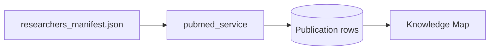

# Data sources — PubMed vs OpenAlex

**Decision (this branch):** PubMed is the primary source for publications, seeding, and Knowledge Map co-author edges. OpenAlex is **not** used as a replacement for paper lists.

## What each source is for

| Goal | Source |
|------|--------|
| Paper list on a profile | **PubMed** |
| Who in RHIP co-authored with whom? | **PubMed** PMIDs → Knowledge Map |
| Which countries/institutions has this ORCID collaborated with? | OpenAlex (optional; not on this branch) |
| “Currently at UNSW” badge | ORCID (identity/affiliation; not PubMed or OpenAlex) |

They answer different questions:

- **PubMed:** “What papers did this person publish?”
- **OpenAlex:** “What field are they in, and who/where have they collaborated with?”

## How PubMed is used here

1. Seed loads [`data/researchers_manifest.json`](../data/researchers_manifest.json).
2. [`Backend/app/services/pubmed_service.py`](../Backend/app/services/pubmed_service.py) fetches (or loads from [`data/pubmed_cache.json`](../data/pubmed_cache.json)) paper metadata.
3. [`Backend/app/seed.py`](../Backend/app/seed.py) stores `Publication` rows and updates profile publication counts.
4. [`Backend/app/services/map_service.py`](../Backend/app/services/map_service.py) builds **coauthor** edges when two seeded profiles share a PMID.

PubMed does **not** supply a world collaboration map, OpenAlex-style primary-field health filters, or a live UNSW employment badge.

## Why not switch to OpenAlex for publications

- RHIP is health-focused; PubMed is the biomedical literature index.
- This branch already depends on PubMed for seed data and Knowledge Map edges.
- Cached PubMed responses keep demos reliable offline (`PUBMED_MODE=cache` / `auto`).
- Replacing PubMed with OpenAlex for papers would break PMID-based coauthor edges unless that graph is rebuilt.

## OpenAlex (deferred)

OpenAlex + ORCID (see the `diva` branch) is useful for:

- Discovering researchers by ORCID and filtering by primary research field
- A **world** collaboration map (co-author countries/institutions)

If that map becomes a priority later, treat OpenAlex as an **extra** feature keyed by `orcid_id` — keep PubMed for paper lists and the internal Knowledge Map. Do not run two competing “where do papers come from?” pipelines.
