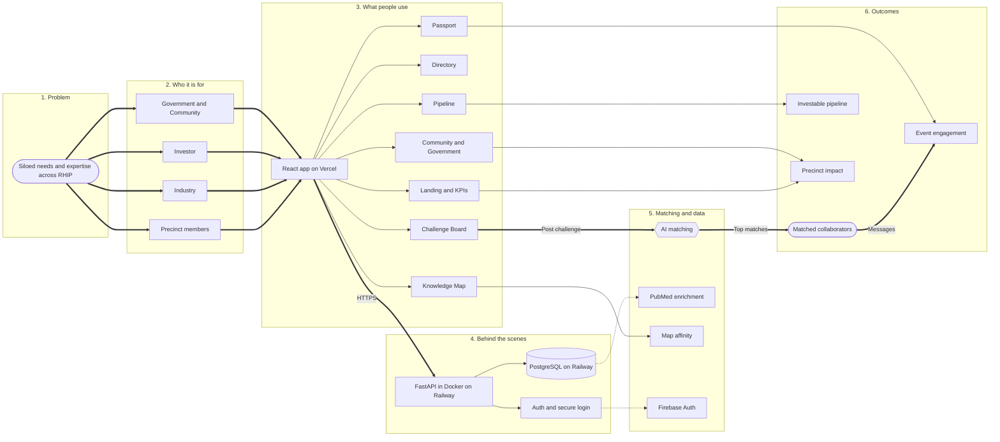
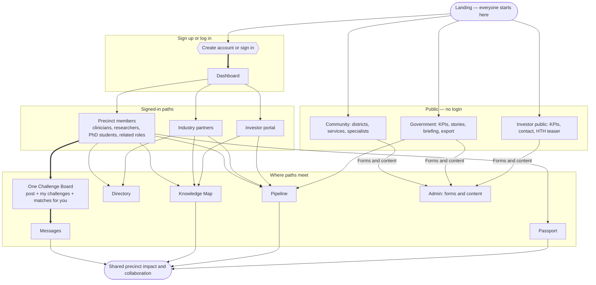
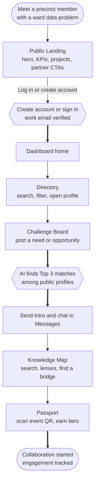
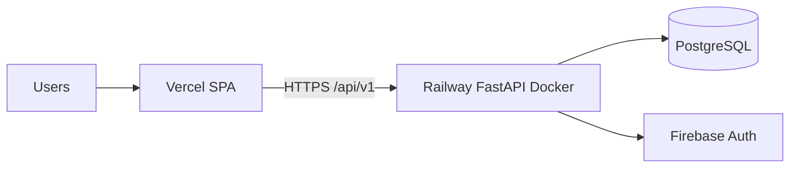

# RHIP Connect — System Story & Audience Paths

Presentation-ready diagrams of how the platform works. Verified **precinct members** (clinicians, researchers, PhD students, and related roles) share **one Challenge Board** — anyone can post and get matched.

**Hosting (demo / shared environment):** React SPA on **Vercel**; FastAPI API in a **Docker** image on **Railway**; **PostgreSQL** on Railway. Local development can still use SQLite.

---

## 1. System story (problem → outcomes)

**How to read it:** Needs sit in silos → different audiences arrive → the website (Vercel) and API (Railway + Docker) connect them → AI matches people on the Challenge Board → collaboration, pipeline visibility, and engagement. Shared demo data lives in **PostgreSQL**, not a laptop SQLite file.

**Data sources:** profile publications and Knowledge Map co-author edges come from **PubMed** (seed + cache). OpenAlex is not the primary paper source on this branch — see [`DATA_SOURCES.md`](./DATA_SOURCES.md).

---

## 2. All audience paths (where they meet)

**Challenge Board (one board):** Verified precinct members share the same experience — post a need, review AI Top 3, send an intro, and see **Matches for you** when others post. AI never matches you to your own challenge. Industry and Investor do not use this board.

---

## 3. Follow a member journey (example)

**Same board for everyone with Challenges access:** clinicians, researchers, PhD students, and related verified members. The example above is one story; any of those people can post or be matched.

---

## 4. Challenge Board in plain language

| What the member does | Behind the scenes |
|----------------------|-------------------|
| Opens Challenge Board | Available to verified clinician / researcher / admin access (includes PhD and related profiles under those access roles) |
| Posts a challenge | Saved; AI matching runs; poster excluded from candidates |
| Reviews Top 3 matches | Scores + short reasons from AI (or mock scoring) |
| Sends an intro | Opens a Messages thread; other person is notified |
| Sees Matches for you | Their profile was selected for someone else’s challenge |

---

## 5. Deployed shape (shared demo)

| Piece | Where it runs |
|-------|----------------|
| React + Vite frontend | **Vercel** |
| FastAPI backend | **Railway** (built from repo **Dockerfile**) |
| Database | **PostgreSQL** on Railway |
| Auth emails / ID tokens | **Firebase Auth** |

Seed the Railway database once (`python -m app.seed`) so directory and demo accounts appear for everyone using the Vercel link. Local SQLite is only for laptop development.

---

## Related boards (FigJam, if you still use them)

- [System Story](https://www.figma.com/board/JnhtskQ71AS6ol2cM2tfse)
- [Follow a User Journey](https://www.figma.com/board/hJCmC74D8gNJX44Udei4wd)
- [All Audience Paths](https://www.figma.com/board/PKz347tILC6qELDsC0W7NR)

This markdown file is the up-to-date source for presentations when FigJam cannot be edited.
